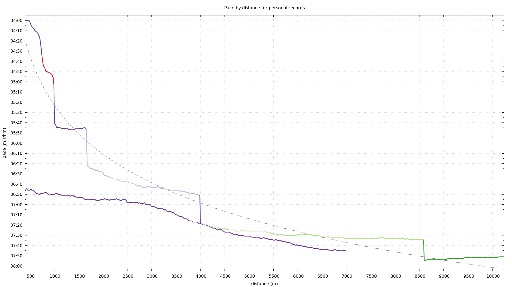
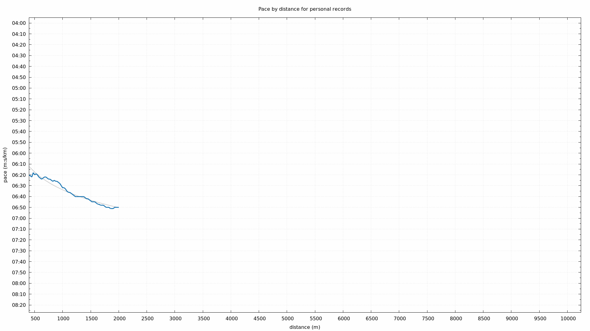
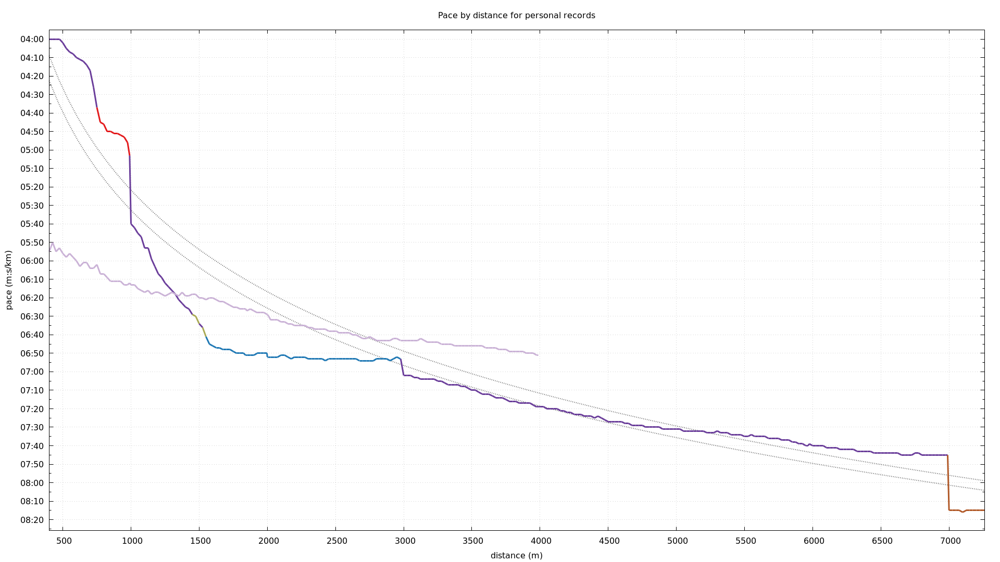

# Strava PR

Strava PR is a tool that analyzes runs from your Strava account to give you some insights on your personal records.

Download the lastest release [here](https://github.com/orium/strava-pr/releases).


# Dependencies

You need to install [gnuplot](http://www.gnuplot.info/) on your system for all command that involve plotting.


# Setup

The first thing you need to do is to get an access token from Strava.  To do so log in to your Strava account and go
[here](https://www.strava.com/settings/api).  Register a the app and you will obtain an access token that will look
something like `21b4fe41a815dd7de4f0cae7f04bbbf9aa0f9507`.  This token has public access only, so it will not see
private runs (private zones will also be respected).

To get the most out of Strava PR you should obtain a access token with write permissions.  That will allow Strava PR
to not only see all runs (including private ones), but also to add extra information to your runs descriptions’.

Follow [this instructions](http://yizeng.me/2017/01/11/get-a-strava-api-access-token-with-write-permission/) to get a
token with write permissions.

To create the configuration file simply run Strava PR with no arguments:

```bash
$ strava-pr
```
```text
There was no configuration file.  I have created one.  Please configure it properly:

    /home/bocage/.config/strava-pr/strava-pr.conf
```

As you can see it will create a configuration file and tell you where it is.  Open it and put your access token there.


# Tutorial

This section shows you the main commands of Strava PR.  It is ordered so that it can serve as a tutorial, so it is a
good idea to read it sequentially.

You can learn more about all the options of Strava PR commands by running `strava-pr --help`.

## Fetching all runs

The first thing you should do is to fetch all runs from Strava.  To do this run

```bash
$ strava-pr strava fetch
```
```text
Fetched 14 runs from Strava.
You have now a total of 14 runs locally.
```

This will fetch all your runs and store them locally.  Of course, already known runs will not be re-downloaded.

The `strava`’s subcommand are the only ones that interacts with Strava.  All other commands will execute based
on the local run store.

## Listing your runs

You can now list all your runs with

```bash
$ strava-pr list
```
```text
run #      date      distance (m)       duration       pace      url
    0   2017-07-10           1999    0 h 13 m 40 s   06'50"/km   https://www.strava.com/activities/1170543416
    1   2017-07-12           2010    0 h 14 m 20 s   07'07"/km   https://www.strava.com/activities/1170543418
    2   2017-07-15           1875    0 h 14 m 30 s   07'44"/km   https://www.strava.com/activities/1170543417
    3   2017-07-21            990    0 h 05 m 00 s   05'03"/km   https://www.strava.com/activities/1171150063
    4   2017-07-24           2508    0 h 17 m 40 s   07'02"/km   https://www.strava.com/activities/1170543421
    5   2017-07-29           5965    0 h 47 m 00 s   07'52"/km   https://www.strava.com/activities/1170543424
    6   2017-08-01           2978    0 h 20 m 30 s   06'53"/km   https://www.strava.com/activities/1170543422
    7   2017-08-04           7261    1 h 00 m 00 s   08'15"/km   https://www.strava.com/activities/1170543434
    8   2017-08-10           6989    0 h 54 m 10 s   07'45"/km   https://www.strava.com/activities/1170543432
    9   2017-08-11           1840    0 h 14 m 40 s   07'58"/km   https://www.strava.com/activities/1170543427
   10   2017-08-12           3988    0 h 27 m 20 s   06'51"/km   https://www.strava.com/activities/1170543414
   11   2017-08-18           1655    0 h 09 m 34 s   05'46"/km   https://www.strava.com/activities/1170543411
   12   2017-08-26           8586    1 h 05 m 09 s   07'35"/km   https://www.strava.com/activities/1170543425
   13   2017-09-05          10241    1 h 20 m 30 s   07'51"/km   https://www.strava.com/activities/1170166278
```

## All-time personal record table

Check your personal records for multiple distance with: 

```bash
$ strava-pr table
```
```text
Best 1000 meters

         time            date         pace       start at (m)   total run dist (m)   url
     0 h 05 m 40 s    2017-08-11    05'40"/km             483                 1840   https://www.strava.com/activities/1170543427
     0 h 05 m 46 s    2017-08-18    05'46"/km               9                 1655   https://www.strava.com/activities/1170543411
     0 h 06 m 13 s    2017-08-12    06'13"/km              14                 3988   https://www.strava.com/activities/1170543414
     0 h 06 m 18 s    2017-07-15    06'18"/km             457                 1875   https://www.strava.com/activities/1170543417
     0 h 06 m 32 s    2017-07-10    06'32"/km             956                 1999   https://www.strava.com/activities/1170543416

...

Best 5000 meters

         time            date         pace       start at (m)   total run dist (m)   url
     0 h 37 m 14 s    2017-08-26    07'26"/km               5                 8586   https://www.strava.com/activities/1170543425
     0 h 37 m 39 s    2017-08-10    07'31"/km            1963                 6989   https://www.strava.com/activities/1170543432
     0 h 37 m 58 s    2017-09-05    07'35"/km               6                10241   https://www.strava.com/activities/1170166278
     0 h 39 m 22 s    2017-07-29    07'52"/km              61                 5965   https://www.strava.com/activities/1170543424
     0 h 40 m 49 s    2017-08-04    08'09"/km               0                 7261   https://www.strava.com/activities/1170543434

...
```

This will take into account all the sub-runs contained within your runs.  For instance, in the example above,
the *5 km* PR happened in a *8.5 km* run.

You can parameterize the distances as well as the number of runs per table.  Run `strava-pr --help` to learn all the
options.

## All-time personal record per distance plot

This will plot a graph of your best pace as a function of the run’s distance.  Once again, this will consider **all
sub-runs** of your runs.   By “all sub-runs” we mean all “run slices” your can possibly make with a run,  starting at
all points and considering all distances.  This means that a run of distance *d* is an attempt for the records for all
runs of distance *≤ d*.

```bash
$ strava-pr show
```


The plot shows each run with a different color.  (I’m lying.  There are a small number of colors and two runs can easily
color-collide.)  It also shows you your an average PR curve (the dashed curve).  One useful way of using this curve is
to estimate a realistic pace for futures runs.  Another encouraging way to look at it is that you can *probably* break
your PR for distances where your PR is below this average curve (provided your fitness is didn’t get worse).

It is also possible to see how a particular run stacks against the PR curve, by providing the run number (which you can
get with `strava-pr list`):

```bash
$ strava-pr show 8
```


This command can also output a PNG image with the option `--to-file`.

## Animated history of all-time personal record per distance

The coolest feature of Strava PR is the animated evolution of your all-time personal record per distance.  This will
create a GIF which will show you each run you made and its contribution to your personal record plot.

```bash
$ strava-pr history history.gif
```


## Add run information to Strava

This command will go through all your Strava runs and create a plot with that run and how it compares with your PR curve,
as it was at the time of the run.  The plot is then uploaded to Imgur and a url to the image in added to your run’s
description in Strava.  Do not worry if your already have descriptions in your runs: this will append a new line to the
existing description.

To use this command you will need to create an Imgur client id and add it to the configuration file.  You also need to
make sure the Strava’s access token has write permissions.

```bash
$ strava-pr strava add-description-history
```
Strava’s run description                             | Plot of that run
:---------------------------------------------------:|:----------------------------------------:
  |  

Here you can easily see that this run broke the PR for all distances between *~1400 m* and *~4000 m*.

Keep in mind that the plot’s images are uploaded to Imgur and will be publicly visible.
